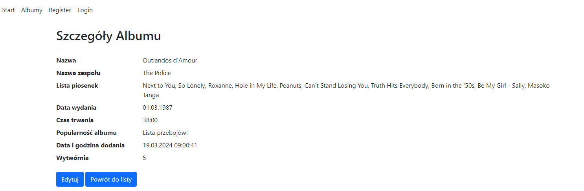
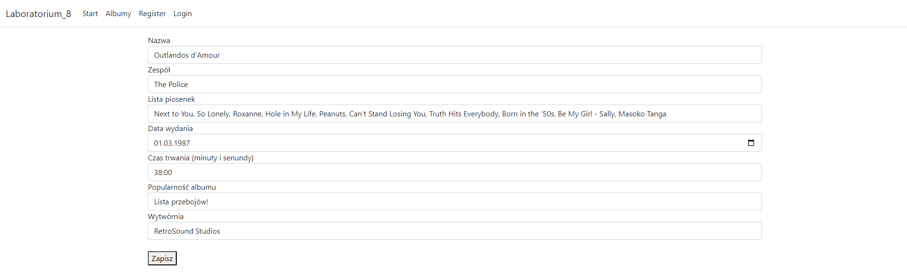
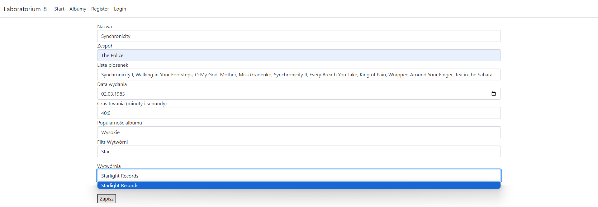
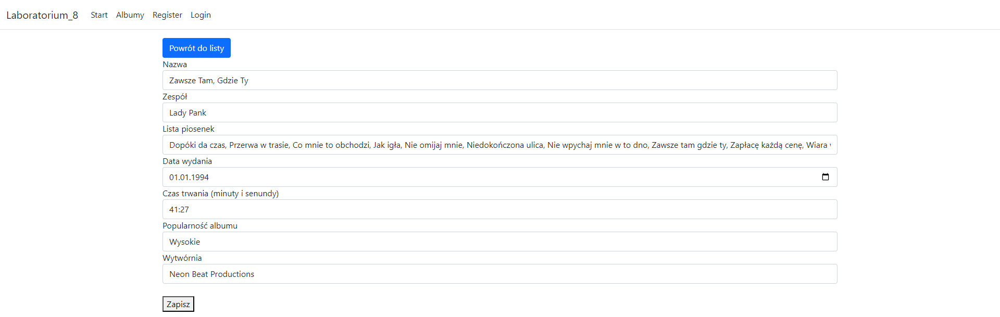

# Prosta Aplikacja webowa ASP.NET MVC do wyświetlania albumów muzycznych, dodawania ich i edycji.

## Funkcje:

## 1. Widok główny na którym można przeglądać albumy muzyczne:

## 2. Szczegóły albumu:

## 3. Tworzenie albumu - Formularz z walidacją wpisywanych danych:

##  4. Drugi rodzaj formularza z wykorzystaniem API (użytkownik może wyszukiwać wytwórnie muzyczne z listy).

## 5. Edycja albumu

## 6. Usuwanie Albumów

### Użyte technologie:

* ASP.NET Core MVC
* Entity FrameWork
* baze danych ms SQL
* identity
